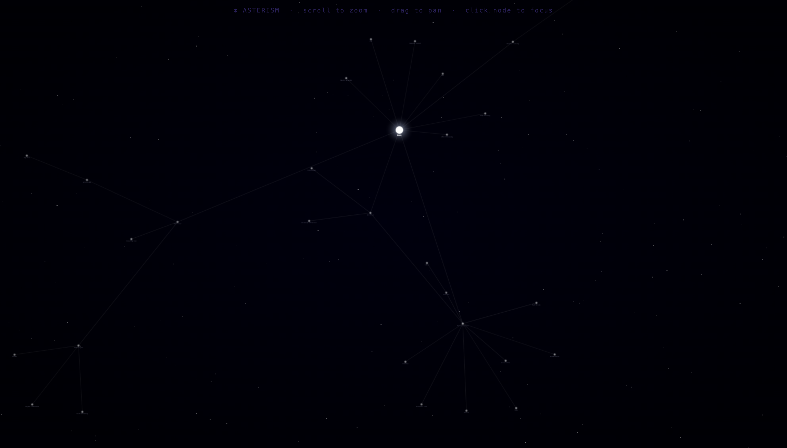
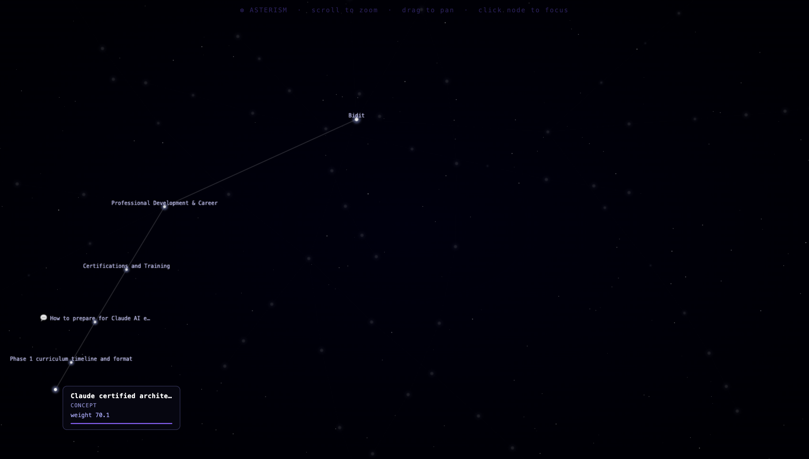

  

# ✦ Asterism

**A local-first personal knowledge graph that thinks like a brain and looks like a constellation.**

Every conversation you have with Claude leaves a trace. Asterism maps those traces into a living star map — the more you think about something, the brighter it glows. Stop thinking about it, and it fades into the dark.

## What it looks like





## How it works

- **Hebbian learning** — edges between concepts strengthen each time the LLM traverses them (`weight += 0.2` per traversal). Concepts that aren't revisited accumulate session exposure time; after 3 hours of uninterrupted exposure without traversal they decay and vanish from the graph.
- **You are the central node** — your user node (Bidit) sits at the centre of the constellation at full brightness, always. It never decays.
- **Local SQLite storage** — the entire graph lives in `~/.asterism/asterism.db`. No cloud, no sync, no accounts.
- **LLM context injection** — on every message, the top-N most relevant nodes and edges are injected into the Claude prompt as implicit context, letting the model answer with awareness of your past thinking.
- **Triple extraction** — each exchange is processed by a fast extraction model (local Ollama or Anthropic Haiku) that pulls `(entity, relationship, entity)` triples and writes them to the graph.

## Quick Start

```bash
# Install
pip install -r requirements.txt

# First-time setup (API key + extractor choice + DB init)
asterism init

# Set your Anthropic API key
export ANTHROPIC_API_KEY=sk-ant-...
# or drop it in .env:
echo "ANTHROPIC_API_KEY=sk-ant-..." > .env

# Launch
asterism chat      # opens the Streamlit chat UI
asterism view      # open the constellation in your browser
```

> Requires Python 3.10+. For local extraction, [Ollama](https://ollama.com) must be installed and `llama3.2:3b` pulled.

## Privacy

Your graph never leaves your machine. The only external calls are to the Anthropic API for Claude responses and (optionally) Haiku-powered triple extraction. The LLM only sees what you explicitly inject from your local graph — it has no access to the raw database. Delete `~/.asterism/` to get a clean slate. No telemetry, no analytics, no accounts.

## Built with

| Layer | Tech |
|---|---|
| Storage | SQLite (`~/.asterism/asterism.db`) |
| Graph | NetworkX |
| Visualization | Vanilla JS force simulation (zero dependencies) |
| LLM | Anthropic SDK — `claude-sonnet-4-6` |
| Extraction | Ollama `llama3.2:3b` (local) or Anthropic Haiku (cloud) |
| UI | Streamlit |
| CLI | Click |

## Author

**Bidit** — [github.com/biditdas18](https://github.com/biditdas18)
