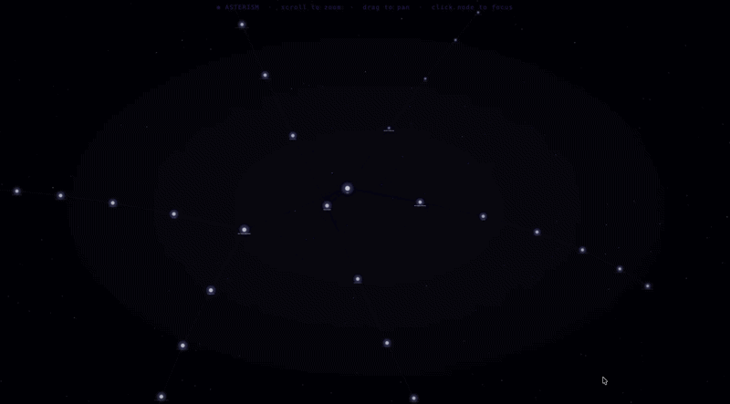
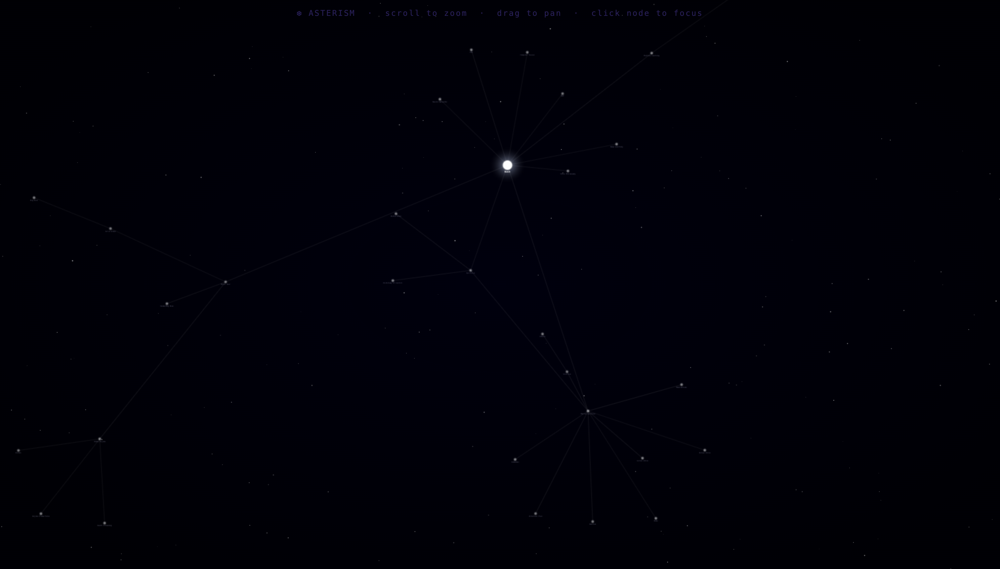
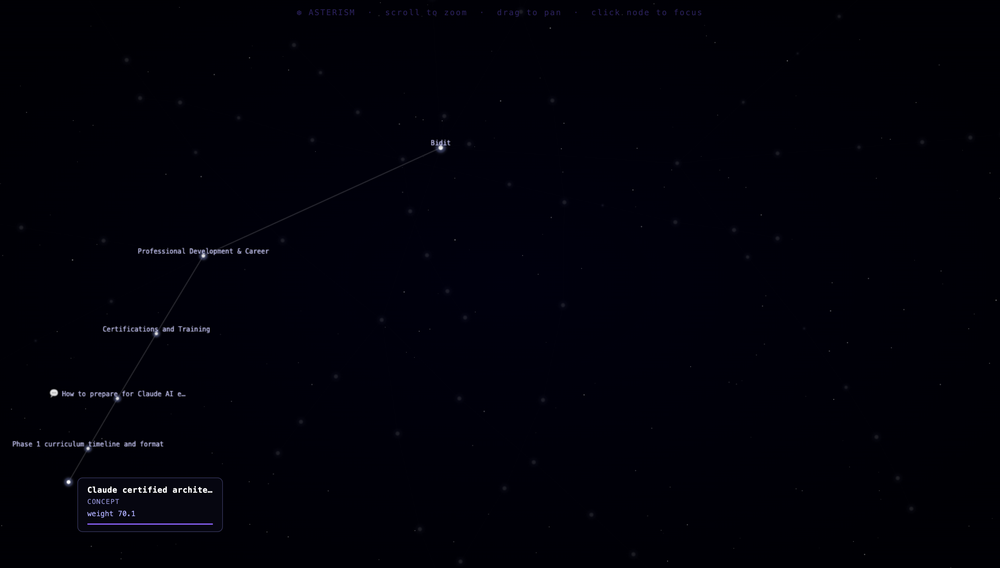

  

# ✦ Asterism

**A local-first personal knowledge graph that thinks like a brain and looks like a constellation.**

Every conversation you have with Claude leaves a trace. Asterism maps those traces into a living star map — the more you think about something, the brighter it glows. Stop thinking about it, and it fades into the dark.

## What it looks like







## How it works

- **Hebbian learning** — edges between concepts strengthen each time the LLM traverses them (`weight += 0.2` per traversal). Concepts that aren't revisited accumulate session exposure time; after 3 hours of uninterrupted exposure without traversal they decay and vanish from the graph.
- **You are the central node** — your user node sits at the centre of the constellation at full brightness, always. It never decays.
- **Local SQLite storage** — the entire graph lives in `~/.asterism/asterism.db`. No cloud, no sync, no accounts.
- **LLM context injection** — on every message, the top-N highest-weight nodes are injected into the model's prompt as context, letting it answer with awareness of your past thinking. See [Research & Evaluation](#research--evaluation) for a measured, honest account of what this buys you.
- **Triple extraction** — each exchange is processed by a fast extraction model (local Ollama or Anthropic Haiku) that pulls `(entity, relationship, entity)` triples and writes them to the graph.
- **Entity resolution** — new labels are checked against existing nodes (exact/prefix match, then a local embedding fallback) so the extractor's inevitable rewordings strengthen an existing node instead of forking a near-duplicate one.
- **Fact supersession** — when a new edge contradicts an existing one from the same source with the same relationship (e.g. "uses Postgres" → "uses SQLite"), the old edge is flagged superseded: excluded from default context injection, but never deleted, so "what did you used to think" queries still work.

## Quick Start

```bash
git clone https://github.com/biditdas18/asterism
cd asterism
chmod +x setup.sh && ./setup.sh
```

Then:
1. Run `asterism init` — guided setup wizard
2. Export your Claude data: claude.ai → Settings → Export Data → check email → download zip
3. `asterism crawl --source claude --path path/to/conversations.json`
4. Your constellation opens automatically

That's it. Your mind as a constellation.

## Project structure

```
asterism/
├── app.py, cli.py           entry points (Streamlit app, `asterism` CLI)
├── db.py, schema.sql        SQLite storage, entity resolution, supersession
├── llm.py, context.py       context injection + multi-backend assistant calls
├── graph.py                 NetworkX view over the graph, decay-safe queries
├── extractor.py, crawler.py triple extraction, conversation-export ingestion
├── decay_scheduler.py       Hebbian decay / chain-healing / orphan-rescue loop
├── render.py, demo_seed.py  constellation HTML renderer, demo dataset
├── tests/                   pytest suite (`pytest` from repo root)
├── research/                evaluation scripts, scorer, and results (see below)
└── papers/                  paper draft (tex + PDF)
```

## Development

```bash
pytest                                 # run the test suite (26 tests; 1 needs ANTHROPIC_API_KEY)
pytest -k "not live_query"             # skip that one if you haven't run `asterism init` yet
python research/benchmark_latency.py   # rerun the latency benchmark (no API key needed)
```

See [Reproducing the evaluation](#reproducing-the-evaluation) below for the full multi-model campaign.

## Privacy

Your graph never leaves your machine. External calls happen only when you choose to: to the Anthropic API for Claude responses, (optionally) Haiku-powered triple extraction, and — only if you run the research evaluation against those models — the OpenAI/Gemini/Groq APIs. Entity-resolution embeddings run locally (ONNX, no network calls after a one-time model download). The LLM only sees what you explicitly inject from your local graph — it has no access to the raw database. Delete `~/.asterism/` to get a clean slate. No telemetry, no analytics, no accounts.

## Research & Evaluation

The core architectural claim — that a weighted knowledge graph acts as a *priority index* over otherwise-flat LLM memory, the same way a B-tree indexes an ordered file — is tested, not asserted, across multiple models and multiple conditions designed to isolate exactly what's doing the work. Full methodology, every prior (superseded) attempt kept rather than overwritten, and every raw result are in [`research/`](research/).

### The finding

Weighted graph structure increases **accurate decisiveness under ambiguity** — and that effect is a property of the *structure*, not of an instruction telling the model to be decisive. It replicates across both Claude models tested; it is absent for the one GPT model tested. Stated at that precision because the data doesn't support a stronger claim, and a weaker one would hide what's actually there.

### Five conditions, isolating structure from instruction

An earlier three-condition version of this eval (`graph` / `flat_list` / `none`) showed a gap between `graph` and `flat_list`, but couldn't tell whether that gap came from the *weighted structure* or from an explicit "prioritize and commit" instruction that only the `graph` prompt happened to carry. Two more conditions isolate the two:

| Condition | Structure (weighted, ranked) | Instruction (prioritize/commit) |
|---|---|---|
| `graph` | yes | yes |
| `graph_neutral` | yes | no |
| `flat_list_prioritized` | no | yes |
| `flat_list` | no | no |
| `none` | no context at all | — |

`graph_neutral` vs. `flat_list` isolates structure alone. `flat_list_prioritized` vs. `flat_list` isolates the instruction alone. `graph` vs. `flat_list_prioritized` asks whether structure adds anything on top of an instruction both already share.

### Results (12 priority-ranking queries, 5 independent runs per model, mean [min–max])

| Model | `graph` | `flat_list_prioritized` | `flat_list` | `graph_neutral` | `none` | Verdict |
|---|---|---|---|---|---|---|
| `claude-sonnet-4-6` | 5.4 [3–8] | 3.6 [3–4] | 3.6 [3–5] | **8.8 [7–11]** | 0.0 [0–0] | STRUCTURAL |
| `claude-opus-4-8` | 6.2 [4–9] | 3.6 [2–5] | 1.6 [0–3] | 5.8 [4–8] | 1.0 [0–2] | MIXED |
| `gpt-5.5-2026-04-23` | 6.6 [3–9] | 6.6 [3–10] | 7.0 [6–8] | 6.6 [5–9] | 2.2 [1–4] | MIXED (no signal) |

Structure alone (`graph_neutral` vs. `flat_list`) shows a real, positive effect for **both Claude models**: +5.2 for sonnet, +4.2 for opus. That's the replicating part. Sonnet's instruction has *no* independent effect (`flat_list_prioritized` ties `flat_list` exactly, 3.6 = 3.6) — for sonnet it's structure alone, cleanly. Opus shows a real instructional effect too (+2.0), on top of the structural one — both levers help, and they compound rather than conflict. GPT-5.5 shows **neither** effect: all four non-`none` conditions are statistically indistinguishable (6.6/6.6/7.0/6.6) — the "MIXED" label means something different there than it does for opus, and the underlying numbers are what settle it, not the label. Only `none` (2.2) is clearly lower for GPT-5.5.

### Commit ≠ correct

A model that confidently commits to the *wrong* priority is worse than an honest hedge — so a separate, deterministic pass checks whether each COMMIT-labeled response actually names the seed graph's true highest-weight node, not just *a* node. Ground truth is derived directly from the seed graph's own weights (see [`correctness_analysis.md`](research/results/correctness_analysis.md) for the exact ranking and the two queries flagged as lower-confidence ground truth).

| Model | graph-like correct-rate | flat/none-like correct-rate |
|---|---|---|
| `claude-sonnet-4-6` | 46% (31/67) | 15% (5/33) |
| `claude-opus-4-8` | 66% (37/56) | 26% (8/31) |
| `gpt-5.5-2026-04-23` | 71% (44/62) | 53% (41/77) |

All three: the added decisiveness is accurate, not just confident noise. **Flagged without spin:** sonnet's plain `graph` condition is still wrong more often than not in absolute terms (54%), even though it clearly beats the alternatives — decisive and mostly-correct are not the same claim.

### Is the scorer trustworthy?

COMMIT/HEDGE labeling is a deterministic keyword+structure classifier, pre-registered and frozen before any scored run, validated to 11/11 on a held-out set drawn from earlier development runs (never from data it went on to score) — see `research/poc_compare_v2.py`'s `VALIDATION_SET`. It has never been retuned based on what a scored run's output looked like, including when that meant reporting a weaker number.

Independently, a human rater scored the same 36 responses the scorer did (sonnet, run 1, `graph`/`flat_list`/`none`): **Cohen's κ = 0.640**, raw agreement 30/36 (83.3%). The 6 disagreements are directional, not noise — the scorer under-counts real commits in `graph` (4/6) and over-counts them in `flat_list` (2/6), which means the measured graph-vs-flat_list gap is a *conservative* estimate of the true effect, not an inflated one. Full confusion matrix and every disagreement in [`scorer_human_agreement.md`](research/results/scorer_human_agreement.md).

### Reproducing the evaluation

```bash
# frozen scorer's own held-out validation (no API calls)
python -c "import sys; sys.path.insert(0,'research'); from poc_compare_v2 import validate; validate()"

# full multi-model campaign: <model> <n_runs>, all 5 conditions, temperature=1.0 pinned,
# reseed-per-call, universal truncation guard - model+condition+run-tagged output,
# nothing clobbers a prior run or model
python research/poc_compare_multimodel.py claude-sonnet-4-6 5     # needs ANTHROPIC_API_KEY
python research/poc_compare_multimodel.py claude-opus-4-8 5       # needs ANTHROPIC_API_KEY
python research/poc_compare_multimodel.py gpt-5.5-2026-04-23 5    # needs OPENAI_API_KEY

# correctness analysis + scorer-human agreement (zero API calls - reads existing results)
python research/correctness_analysis.py
python research/score_agreement.py
```

Copy `.env.example` to `.env` and fill in whichever key(s) the models you're running need. `GEMINI_API_KEY`/`GROQ_API_KEY` are reserved for a not-yet-run cross-vendor extension of this eval; only `ANTHROPIC_API_KEY` and `OPENAI_API_KEY` are exercised by anything in this repo today.

**Reproducibility knobs, all active by default in the campaign above:**
- **Fixed decoding temperature** (1.0, sent explicitly on both backends) — if a model ever rejects the param, the run raises rather than silently retrying without it.
- **Reseed-per-call invariant** — the eval DB is wiped and reseeded from the pristine seed graph before *every individual call*, not once per run, with the (node, edge) count asserted constant; a run aborts before spending an API call if that invariant ever breaks.
- **Universal truncation guard** — every response is checked against its backend's own truncation/empty signal (OpenAI `finish_reason`, Anthropic `stop_reason`) before it can reach the scorer; a truncated or empty response raises instead of being silently counted as a hedge.
- **Model+condition+run-tagged output files** — no run, model, or phase of this eval has ever overwritten another; every superseded attempt (including a discarded first GPT-5.5 baseline that turned out to be silently truncating ~8% of the time, and one opus batch killed mid-run by a billing exhaustion) is disclosed in the commit history and result files rather than quietly replaced.

See [`research/README.md`](research/README.md) for the full script-by-script index, [`RESEARCH.md`](RESEARCH.md) for the dated development record, and [`papers/`](papers/) for the paper draft.

## Built with

| Layer | Tech |
|---|---|
| Storage | SQLite (`~/.asterism/asterism.db`) |
| Graph | NetworkX |
| Entity resolution | fastembed (ONNX, local) — `BAAI/bge-small-en-v1.5` |
| Visualization | Vanilla JS force simulation (zero dependencies) |
| LLM (product) | Anthropic SDK — `claude-sonnet-4-6` by default |
| LLM (evaluation) | Anthropic (`claude-sonnet-4-6`, `claude-opus-4-8`) + OpenAI (`gpt-5.5-2026-04-23`) — model is a parameter, not hardcoded, in `llm.converse()` |
| Extraction | Ollama `llama3.2:3b` (local) or Anthropic Haiku (cloud) |
| UI | Streamlit |
| CLI | Click |

## Author

**Bidit** — [github.com/biditdas18](https://github.com/biditdas18)
